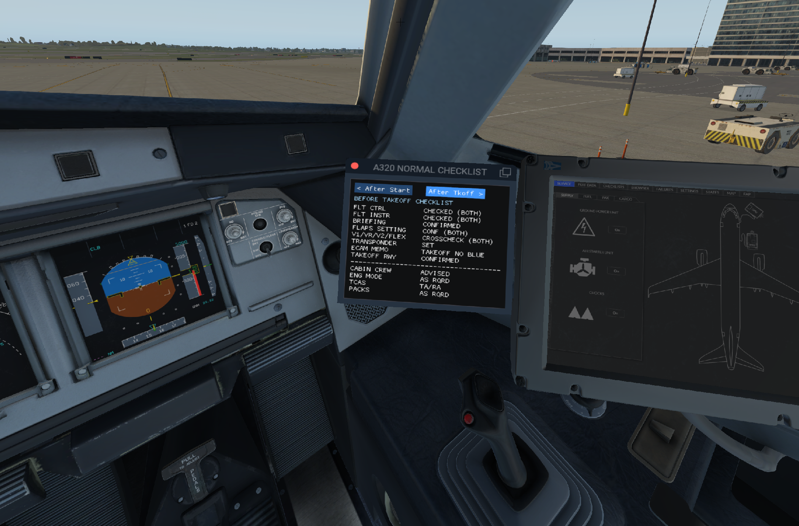

# A320 NORMAL CHECKLIST

## Overview

A simple A320 normal checklist (from Before Start to Securing Aircraft) using FlyWithLua. It can be moved freely within the cockpit and is completely independent (no PDF switching in Avitab etc. required).

It is based on real-world airline checklists, with a tiny perk: The After Approach checklist has a down-to line to manage cockpit workload a bit better while being vectored, receiving runway changes or simply not willing to wait until descending through transition altitude.

## Installation

* Install FlyWithLua: https://forums.x-plane.org/index.php?/files/file/38445-flywithlua-ng-next-generation-edition-for-x-plane-11-win-lin-mac/
* Download [latest A320 NORMAL CHECKLIST release](https://github.com/VerticalLongboard/xplane-a320-checklist/releases/latest)
* *Use installer executable* and specify your X-Plane installation folder or unzip manually:
  * Move dependencies to `<X-Plane 11 Folder>/Resources/plugins/FlyWithLua/Modules`
  * Move `vhf_helper.lua` to `<X-Plane 11 Folder>/Resources/plugins/FlyWithLua/Scripts`

## Usage

* Go to `Plugins/FlyWithLua/FlyWithLua Macros/A320 NORMAL CHECKLIST`
* Place and scale the window wherever you like (in 2D and VR)
* Use the prev/next buttons to switch checklists
* **Fly safe (and calm)! :-)**

## Dependencies

Additional dependencies besides X-Plane 11, SmartCopilot and FlyWithLua:
- LUA INI Parser
(bundled with each release)
